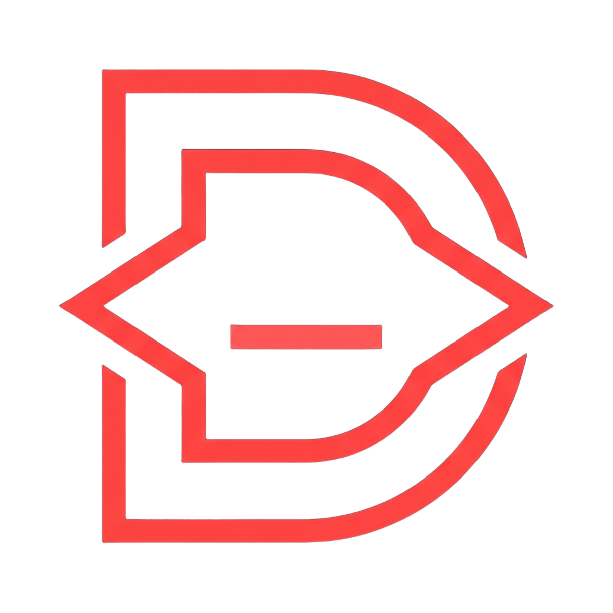

<div align="center">



# Gerardo Erick Plasencia Torres
### Analista de Desarrollo & Sysadmin | Full Stack Developer

[](https://darknezz.dev)
[](https://linkedin.com/in/gerardo-plasencia)
[](mailto:gerardo@darknezz.dev)
[](https://github.com/YamiDarknezz)

</div>

---

## 🚀 Perfil Profesional

Ingeniero de software y Sysadmin enfocado en la **construcción de sistemas en producción, infraestructura segura sobre Linux y pipelines de datos de alto rendimiento**. 

Actualmente en **Pauser Distribuciones SAC** (Área de Mejora Continua), donde asumí la gobernanza integral del servidor de producción (Ubuntu 24.04 LTS con 30+ contenedores bajo Docker, Dokploy y Traefik) y diseñé el ecosistema de microservicios corporativos: autenticación centralizada (**AuthOps**), telemetría de flotas vehiculares (**MechGuard**), portal web unificado (**Frontend-Central**) y motor de ingesta de datos (**Pauser Maestros**), además de pipelines ETL hacia **Power BI** y automatizaciones operativas con **n8n**, **Power Automate** y bots de mensajería.

- 🎓 **Formación:** Estudiante de último ciclo de Ingeniería de Sistemas Computacionales (egreso Dic 2026) en la Universidad Privada del Norte.
- 📜 **Certificaciones Oficiales Cisco:** Hacker Ético, CCNA 2 (SRWE), CCNA 1 (ITN) y Cybersecurity Essentials.
- 📍 **Disponibilidad:** Remoto / Híbrido / Presencial (Trujillo / Lima, Perú).

---

## 🏆 Proyectos Destacados

### 🛡️ [darknezz-infra](https://github.com/YamiDarknezz/darknezz-infra) — Baseline Server Hardening & GitOps
> Plataforma de aprovisionamiento e infraestructura como código (IaC) para servidores Linux en producción:
> - **Ingress Seguro:** Reverse proxy con **Traefik v3** y emisión automatizada de certificados wildcard SSL (`*.darknezz.dev`) vía Cloudflare DNS API.
> - **Orquestación PaaS:** Despliegue y administración de contenedores mediante **Dokploy** y Docker Compose.
> - **Hardening Host:** UFW estricto (solo 22 y 443), llaves SSH Ed25519 (bloqueo total de root/passwords), Fail2ban activo y observabilidad con **Prometheus & Grafana**.
>
>       
>
> 🔗 **[Ver Repositorio en GitHub](https://github.com/YamiDarknezz/darknezz-infra)**

---

### 📦 [inventory-api](https://github.com/YamiDarknezz/inventory-api) — API REST Empresarial en Java 21 & Spring Boot 3
> Servicio backend de gestión de inventarios y control de stock bajo estándares de ingeniería de software:
> - **Seguridad & RBAC:** Autenticación mediante **JWT** y control de accesos granular basado en roles.
> - **Arquitectura & Calidad:** Validación estricta de DTOs, persistencia relacional con Spring Data JPA sobre **PostgreSQL**, y arquitectura limpia por capas.
> - **Documentación Viva:** Especificación OpenAPI 3.0 con interfaz **Swagger UI** interactiva desplegada en producción.
>
>      
>
> 🔗 **[Ver Repositorio en GitHub](https://github.com/YamiDarknezz/inventory-api)** · 🌐 **[Swagger UI en Vivo](https://api-inventory.darknezz.dev/swagger-ui/index.html)**

---

### ⚡ Pauser Maestros (Extractor Maestro) — Ingesta & Replicación Multi-Proveedor
> Middleware de ingesta de alto rendimiento para desacoplar proveedores externos críticos en Pauser Distribuciones SAC:
> - **Desacoplamiento Absoluto:** Extracción incremental desde ERP corporativo (Progress OpenEdge/ODBC), combustible Primax y telemetría de flotas ProGPS.
> - **Alto Rendimiento:** Control de concurrencia con `asyncio.Semaphore` y procesamiento vectorial en memoria con DataFrames de **Polars**.
> - **Latencias <15ms:** Replicación limpia en **PostgreSQL** mediante upserts atómicos masivos, reduciendo tiempos de consulta de >8s a milisegundos para microservicios internos.
>
>     
>
> 📖 **[Ver Caso de Estudio en darknezz.dev](https://darknezz.dev)** *(Código propietario Pauser)*

---

### 🌐 [Darknezz.dev](https://darknezz.dev) — Portafolio Web Reactivo & Hub de Arquitectura
> Single Page Application construida con los últimos estándares del ecosistema frontend:
> - **Reactividad Moderna:** 100% Standalone Components en **Angular 21** con **Signals & LinkedSignal** para estado puro.
> - **UI & Rendimiento:** Estilizado moderno con **Tailwind CSS v4**, micro-animaciones con GSAP, soporte PWA y compilación con 0 errores.
> - **Casos de Estudio Técnicos:** Documentación interactiva de AuthOps, MechGuard, Extractor Maestro y Darknezz-Infra.
>
>     
>
> 🌐 **[Explorar darknezz.dev](https://darknezz.dev)** · 📄 **[Descargar CV Ejecutivo](https://darknezz.dev/CV_Gerardo_Plasencia.pdf)**

---

## 💻 Stack Tecnológico

### Backend & APIs


### Frontend Engineering


### Bases de Datos & Storage


### Infraestructura & DevOps (Sysadmin)


### Business Intelligence & Automatización


### Redes & Ciberseguridad


---

## 💼 Experiencia Laboral

```text
Pauser Distribuciones S.A.C. | Trujillo, Perú (12 sedes operativas)
├── Analista de Desarrollo de Software & Sysadmin ────────────── [Jul 2026 — Actualidad]
│   • Gobernanza del servidor VPS (Ubuntu 24.04 LTS) con 30+ contenedores bajo Dokploy y Traefik.
│   • Arquitectura de microservicios: AuthOps (IAM Centralizado), MechGuard (Flota), Pauser Maestros (ETL).
│   • Pipelines de ingesta desde ERP, Excel y SharePoint hacia PostgreSQL; dashboards ejecutivos en Power BI.
│   • Automatización de alertamiento temprano y reportes operativos vía Power Automate, n8n y WhatsApp bots.
│
└── Trainee de Desarrollo de Software (Part-Time) ────────────── [Ene 2026 — Jun 2026]
    • Migración planificada de servidor Linux desde versiones legadas a Ubuntu 24.04 LTS sin caídas de servicio.
    • Despliegue de plataforma PaaS con Dokploy y Traefik; desarrollo inicial de AuthOps y MechGuard.

Clínica Ocupacional MedCorp S.A.C. | Lima, Perú
└── Pasante en Desarrollo de Software ────────────────────────── [Ago 2025 — Nov 2025]
    • Digitalización de historias clínicas (Flask + SQL Server + Angular), reduciendo tiempos en un 80%.
    • Desarrollo integral de 6 módulos médicos (EMO, atenciones, vigilancia ocupacional, signos vitales).
    • Implementación sobre Windows Server con IIS y transacciones ACID en SQL Server.
```

---

## 🎓 Educación & Certificaciones

- **Ingeniería de Sistemas Computacionales** — Universidad Privada del Norte (UPN) | *Mar 2022 – Dic 2026 (Último ciclo)*
- **Hacker Ético** — Cisco Networking Academy
- **CCNA: Switching, Routing, and Wireless Essentials (CCNA 2)** — Cisco Networking Academy
- **CCNA: Introduction to Networks (CCNA 1)** — Cisco Networking Academy
- **Cisco Cybersecurity Essentials** — Cisco Networking Academy

---

<div align="center">

**¿Hablamos de un proyecto o una oportunidad?**

[](https://linkedin.com/in/gerardo-plasencia)
[](https://wa.me/51947013696)
[](mailto:gerardo@darknezz.dev)

</div>
